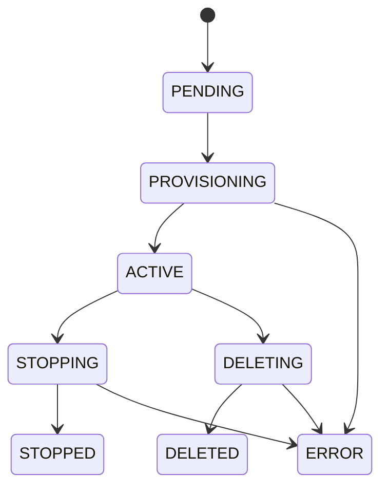

# VM Management Service

## Overview

This service exposes a FastAPI API for virtual machine lifecycle management, with async task tracking for long-running provisioning operations and an OpenStack adapter for production infrastructure. The stack is Python 3.11+, FastAPI, Pydantic, pydantic-settings, pytest, Ruff, and openstacksdk. The code follows a clean-architecture split: API routes handle HTTP, services own business rules and state transitions, repositories isolate infrastructure, models define typed contracts, and core contains settings and cross-cutting error handling.

## Architecture

### Repository Pattern

The repository boundary lets the service swap VM backends without changing API or business logic. `InMemoryVMRepository` is used for local development and tests, while `OpenStackVMAdapter` targets Nova, Neutron, and Cinder via openstacksdk for production. Both implementations satisfy the same `VMRepository` protocol, so the service depends on behavior rather than provider-specific SDK objects.

### Dependency Injection

FastAPI `Depends()` is used to wire `VMService`, `VMRepository`, and `TaskRepository` instead of relying on global singletons. This keeps request-time dependencies explicit, makes tests easy to override, and avoids hiding environment-specific behavior behind module import side effects. The adapter selection happens in `app/api/dependencies.py`, driven by settings.

### Async Provisioning

VM provisioning in OpenStack can take 30-120 seconds, so `POST /vms` uses the 202 Accepted pattern. The API reserves a VM id, creates a task, returns immediately, and runs provisioning in a FastAPI `BackgroundTasks` worker. Clients poll `GET /tasks/{task_id}` or `GET /vms/{vm_id}/status` instead of keeping HTTP connections open.

### VM State Machine



Invalid transitions raise `VMInvalidStateError`. For example, a `PENDING` VM cannot be stopped, and a `DELETED` VM cannot be restarted.

## API Reference

| Method | Path | Request body | Response | Notes |
| --- | --- | --- | --- | --- |
| `GET` | `/health` | None | `{"status": "ok", "environment": "..."}` | Health endpoint for probes and load balancers. |
| `POST` | `/vms` | `VMCreate` | `202` `VMCreateAccepted` | Reserves a VM id, creates a provisioning task, and starts background provisioning. |
| `GET` | `/vms/{vm_id}` | None | `200` `VMRead` | Returns current VM details or `404` if missing. |
| `GET` | `/vms/{vm_id}/status` | None | `200` `VMStatusResponse` | Returns current VM state plus the latest task for that VM. |
| `DELETE` | `/vms/{vm_id}` | None | `200` `VMOperationResponse` | Transitions `ACTIVE -> DELETING -> DELETED`; invalid states return `409`. |
| `GET` | `/tasks/{task_id}` | None | `200` `TaskRead` | Returns task status, VM id, timestamps, and error text when present. |

## Running Locally

1. Create and activate a virtual environment.

   ```bash
   python3.11 -m venv .venv
   source .venv/bin/activate
   ```

2. Install the project with development dependencies.

   ```bash
   pip install -e ".[dev]"
   ```

3. Configure local settings. The default backend is in-memory.

   ```bash
   cp .env.example .env
   ```

   For local development, keep:

   ```bash
   VM_REPOSITORY_BACKEND="memory"
   ```

4. Start the API.

   ```bash
   uvicorn app.main:app --reload
   ```

5. Open the Swagger UI.

   ```text
   http://127.0.0.1:8000/docs
   ```

## Running With Real OpenStack

Set the OpenStack credentials and select the OpenStack repository backend:

```bash
export VM_REPOSITORY_BACKEND="openstack"
export OS_AUTH_URL="https://openstack.example.com:5000/v3"
export OS_USERNAME="your-user"
export OS_PASSWORD="your-password"
export OS_PROJECT_NAME="your-project"
export OS_USER_DOMAIN_NAME="Default"
export OS_PROJECT_DOMAIN_NAME="Default"
export OS_REGION_NAME="RegionOne"
export OS_NETWORK_NAME="private-network"
```

Then run the service normally:

```bash
uvicorn app.main:app --reload
```

The adapter is selected in `app/api/dependencies.py`. `get_vm_repository()` reads `VM_REPOSITORY_BACKEND`; when it is `openstack`, it constructs `OpenStackVMAdapter`, otherwise it uses `InMemoryVMRepository`. This keeps the swap at the DI layer and avoids provider conditionals in routes or service code.

## Running Tests

```bash
pytest tests/ --cov=app --cov-report=term-missing --cov-fail-under=80
```

Lint and formatting checks:

```bash
ruff check .
ruff format --check .
```

## Backlog / What I'd Build Next

1. Persistent DB with PostgreSQL + SQLAlchemy async: keep VM and task state durable across process restarts and multiple API replicas.
2. Prometheus `/metrics` endpoint: expose request latency, task durations, provider failures, and VM lifecycle counts for operational visibility.
3. GitLab CI pipeline: mirror the GitHub Actions lint/test workflow for teams running merge requests in GitLab.
4. cloud-init support on VM creation: pass user data and metadata into Nova so created VMs can bootstrap themselves safely.
5. Volume snapshot/backup APIs using Cinder: add snapshot, restore, and backup workflows for persistent VM storage.
6. Rate limiting + auth middleware: protect provider quotas and expose the service safely to multiple tenants or automation clients.
7. Task worker extraction: move provisioning from FastAPI `BackgroundTasks` into Celery, Dramatiq, or Arq for retries and horizontal scale.
8. OpenTelemetry tracing: correlate HTTP requests, task execution, and OpenStack SDK calls across distributed systems.
